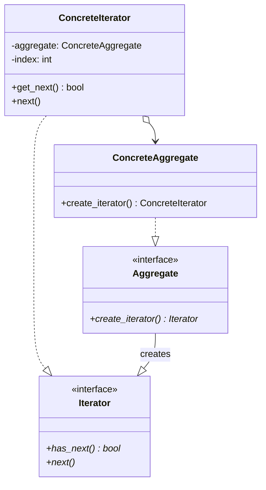

# Iteratorパターン

## クラス図

```mermaid
classDiagram
    class Aggregate {
        <<interface>>
        +create_iterator()* Iterator
    }
    class Iterator {
        <<interface>>
        +has_next()* bool
        +next()*
    }
    class ConcreteAggregate {
        +create_iterator() ConcreteIterator
    }
    class ConcreteIterator {
        -aggregate: ConcreteAggregate
        -index: int
        +get_next() bool
        +next()
    }
    ConcreteIterator ..|> Iterator
    ConcreteAggregate ..|> Aggregate
    Aggregate --|> Iterator : creates
    ConcreteIterator o--> ConcreteAggregate
```

## メモ

* Iterableなクラス(`Aggregate`)は`create_iterator()`を持ち、自分に対応するIteratorを呼び出す。
* Iteratorには最低限、次の要素を呼び出す`next()`と、次の要素があるかどうか確認する`has_next(): bool`の二つのメソッドが必要。
